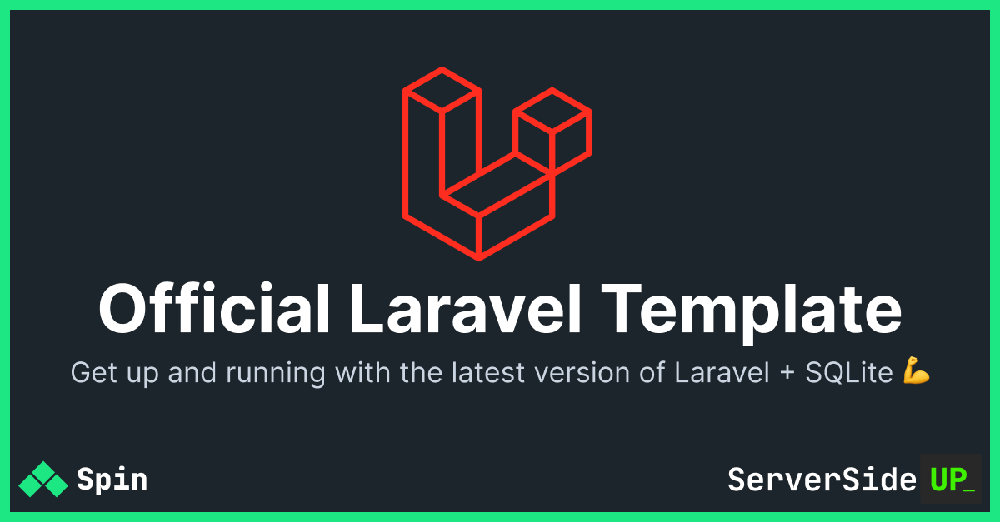

<p align="center">
		<a href="https://serversideup.net/open-source/spin/"></a>
</p>

# 🏆 Official "Laravel Basic" Template by Spin
This is the official Spin template for Laravel that helps you get up and running with:

- Latest version of Laravel
- SQLite

## Looking for more features?
We have a "[Spin Pro Laravel Template](https://getspin.pro)" that includes more features for Laravel Pros:

| Feature | Spin Basic Laravel Template | Spin Pro Laravel Template |
|---------|---------------------------|-----------|
| Price | Free | $199/once (lifetime access) |
| Automated Deployments with GitHub Actions | ❌ | ✅ |
| Local Development SSL | ❌ | ✅ (Trusted) |
| Tunnel Support | ❌ | ✅ |
| SMTP Trapping | ❌ | ✅ (Mailpit) |
| Vite over HTTPS | ❌ | ✅ |
| Databases | SQLite | ✅ MariaDB, MySQL, PostgreSQL, SQLite |
| Redis | ❌ | ✅ |
| Meilisearch |  ❌ | ✅ |
| Laravel Horizon | ❌ | ✅ |
| Laravel Reverb | ❌ | ✅ |
| Laravel Queues | ❌ | ✅ |
| Mailpit over HTTPS | ❌ | ✅ |
| Node Package Manager | `yarn` | `yarn` or `npm` |
| Support | ✅ Discord, GitHub Discussions | ✅ Private Community Support |

If you're interested in the Pro version, you visit [https://getspin.pro](https://getspin.pro) for more information.

## Default configuration
To use this template, you must have [Spin](https://serversideup.net/open-source/spin/docs) installed.

```bash
spin new laravel my-laravel-app
```

By default, this template is configured to work with [`spin deploy`](https://serversideup.net/open-source/spin/docs/command-reference/deploy) out of the box. If you prefer to use CI/CD to deploy your files (which is a good idea for larger teams), you'll need to make additional changes (see the "Advanced Configuration" section below).

Before running `spin deploy`, ensure you've complete the following:

1. **ALL** steps from "Required Changes Before Using This Template" section have been completed
1. You've customized and have a valid [`.spin.yml`](https://serversideup.net/open-source/spin/docs/guide/preparing-your-servers-for-spin#configure-other-server-settings) file
1. You've customized and have a valid [`.spin-inventory.yml`](https://serversideup.net/open-source/spin/docs/guide/preparing-your-servers-for-spin#inventory)
1. Your server is online and has been provisioned with [`spin provision`](https://serversideup.net/open-source/spin/docs/command-reference/provision)


Once the steps above are complete, you can run `spin deploy` to deploy your application:

```bash
spin deploy <environment-name>
```

### 🌎 Default Development URLs
- **Laravel**: [http://localhost](http://localhost)
- **Mailpit**: [http://localhost:8025](http://localhost:8025)

## 👉 Required Changes Before Using This Template
> [!CAUTION]
> You need to make changes before using this template.

### Create an `.env.production` file
By default, this template is configured to use `spin deploy` which defaults to the `production` environment. You need to create an `.env.production` file in the root of your project.

```bash
cp .env.example .env.production
```

Configure your `.env.production` file with the appropriate values for your production environment. Ensure `APP_URL` is set correctly. Spin will use the domain from that variable as the production URL by default.

### Set your production URL
Almost everyone wants to run HTTPS with a valid certificate in production for free and it's totally possible to do this with Let's Encrypt. You'll need to let Let's Encrypt which domain know what domain you are using.

> [!WARNING]
> **You must have your DNS configured correctly (with your provider like CloudFlare, NameCheap, etc) AND your server accessible to the outside world BEFORE running a deployment.** When Let's Encrypt validates you own the domain name, it will attempt to connect to your server over HTTP from the outside world using the [HTTP-01 challenge](https://letsencrypt.org/docs/challenge-types/). If your server is not accessible during this process, they will not issue a certificate.

```yaml
# File to update:
# docker-compose.prod.yml

      labels:
        - "traefik.enable=true"
        - "traefik.http.routers.my-php-app.rule=Host(`${SPIN_APP_DOMAIN}`)"
```

By default, if you're using `spin deploy` it will use the `APP_URL` from your `.env.<environment>` file to generate the `SPIN_APP_DOMAIN`. You can also be explicit and change `${SPIN_APP_DOMAIN}` to `myapp.example.com`.

### Set your email contact for Let's Encrypt certificates
Let's encrypt requires an email address to issue certificates. You can set this in the Traefik configuration for production.

```yml
# File to update:
# .infrastructure/conf/traefik/prod/traefik.yml

certificatesResolvers:
  letsencryptresolver:
    acme:
      email: "changeme@example.com"
```

Change `changeme@example.com` to a valid email address. This email address will be used by Let's Encrypt to send you notifications about your certificates.

### Determine if you want to use the "AUTORUN" feature
By default, we have [Laravel Automations](https://serversideup.net/open-source/docker-php/docs/laravel/laravel-automations) configured to run with the [serversideup/php](https://serversideup.net/open-source/docker-php/) Docker image.

If you do not want this behavior, you can remove the `AUTORUN_ENABLED` environment variable from the `php` service in the `docker-compose.prod.yml` file.

```yml
# File to update:
# docker-compose.prod.yml

  php:
    image: ${SPIN_IMAGE_DOCKERFILE}
    environment:
      - AUTORUN_ENABLED: "true" # 👈 Remove this line if you don't want Laravel Automations
```

## ⚡️ Initializing in an existing project
If you're using an existing project with SQLite, you will need to move your database to a volume, especially if you're deploying to production with these templates.

### Background
Laravel comes with the default path of `database/database.sqlite`. This path is not ideal for Docker deployments, because the parent directory of this file contains other database files used by Laravel.

For Docker Swarm (what is used in production), we need to place the SQLite in a dedicated folder so we can mount a Docker Volume to ensure the data persists.

### Laravel ENV Changes
To prepare the project, we automatically set the `DB_DATABASE` environment variable.

```bash
# Set absolute path to SQLite database from the container's perspective
DB_DATABASE=/var/www/html/.infrastructure/volume_data/sqlite/database.sqlite
```

**NOTE:** Notice how this is the ABSOLUTE path to the database file. The reason why we use `/var/www/html` is because that is the absolute path to the file **in the eyes of the CONTAINER** (not the host machine).

### Development Setup For SQLite
Your project folder is mounted as `/var/www/html` inside the container. You simply need to ensure the `.infrastructure/volume_data/sqlite/database.sqlite` file exists in your project folder on your host. Move your existing database file to this location if you want to migrate your data.

### Production Setup For SQLite
We automatically create a `database_sqlite` volume in production. This volume is mounted to `/var/www/html/.infrastructure/volume_data/sqlite/` to the `php` service.

## 🚀 Running Laravel Specific Commands
In development, you may want to run artisan commands or composer commands. We can use [`spin run`](https://serversideup.net/open-source/spin/docs/command-reference/run) or [`spin exec`](https://serversideup.net/open-source/spin/docs/command-reference/exec) to run these commands.

```bash
spin run php php artisan migrate
```
The above command will create a new container to run the `php artisan migrate` command. You can change `run` for `exec` if you'd like to run the command in an existing, **running** container.

```bash
spin run php composer install
```

The above command will create a new container to run the `composer install` command. This is helpful if you need to install new packages or update your `composer.lock` file.

If you need to attach your terminal to the container's shell, you can use `spin exec`:

```bash
spin exec -it php sh
```

This will attach your terminal to the `php` container's shell. If you're using an Alpine image, `sh` is the default shell. If you're using a Debian image, you can use `bash` instead of `sh`.

Feel free to run any commands you'd like with `spin run` or `spin exec`. The above examples should help give you patterns what you need to do.

## 👨‍🔬 Advanced configuration
If you'd like to further customize your experience, here are some helpful tips:

### Trusted SSL certificates in development
We provide certificates by default. If you'd like to trust these certificates, you need to install the CA on your machine.

**Download the CA Certificate:**
- https://serversideup.net/ca/

You can create your own certificate trust if you'd like too. Just simply replace our certificates with your own.

### Change the deployment image name
If you're using CI/CD (and NOT using `spin deploy`), you'll likely want to change the image name in the `docker-compose.prod.yml` file.

```yaml
  php:
    image: ${SPIN_IMAGE_DOCKERFILE} # 👈 Change this if you're not using `spin deploy`
```

Set this value to the published image with your image repository.

### Set the Traefik configuration MD5 hash
When running `spin deploy`, we automatically grab the MD5 hash value of the Traefik configuration and set it to `SPIN_TRAEFIK_CONFIG_MD5_HASH`. This efficiently ensures your Docker Swarm Configuration is always up to date.

Be sure to change this value or set the MD5 hash so you can continue to receive the benefits of getting the best deployment strategy when updating Docker Swarm configurations with Traefik.

```yaml
configs:
  traefik:
    name: "traefik-${SPIN_TRAEFIK_CONFIG_MD5_HASH}.yml"
    file: ./.infrastructure/conf/traefik/prod/traefik.yml
```

## Resources
- **[Website](https://serversideup.net/open-source/spin/)** overview of the product.
- **[Docs](https://serversideup.net/open-source/spin/docs)** for a deep-dive on how to use the product.
- **[Discord](https://serversideup.net/discord)** for friendly support from the community and the team.
- **[GitHub](https://github.com/serversideup/spin)** for source code, bug reports, and project management.
- **[Get Professional Help](https://serversideup.net/professional-support)** - Get video + screen-sharing help directly from the core contributors.

## Contributing
As an open-source project, we strive for transparency and collaboration in our development process. We greatly appreciate any contributions members of our community can provide. Whether you're fixing bugs, proposing features, improving documentation, or spreading awareness - your involvement strengthens the project. Please review our [contribution guidelines](https://serversideup.net/open-source/spin/docs/community/contributing) and [code of conduct](./.github/code_of_conduct.md) to understand how we work together respectfully.

- **Bug Report**: If you're experiencing an issue while using this project, please [create an issue](https://github.com/serversideup/spin-template-laravel/issues/new).
- **Feature Request**: Make this project better by [submitting a feature request](https://github.com/serversideup/spin-template-laravel/issues/new).
- **Documentation**: Improve our documentation by contributing to this README
- **Community Support**: Help others on [GitHub Discussions](https://github.com/serversideup/spin/discussions) or [Discord](https://serversideup.net/discord).
- **Security Report**: Report critical security issues via [our responsible disclosure policy](https://www.notion.so/Responsible-Disclosure-Policy-421a6a3be1714d388ebbadba7eebbdc8).

Need help getting started? Join our Discord community and we'll help you out!

<a href="https://serversideup.net/discord"></a>

<!-- serversideup-sponsors -->
## Our Sponsors
All of our software is free and open to the world. None of this can be brought to you without the financial backing of our sponsors.

<p align="center"><a href="https://github.com/sponsors/serversideup"></a></p>

### Platinum Sponsors
<a href="https://sevalla.com"></a>

### Silver Sponsors
<a href="https://giga-infosystems.com"></a>

### Infrastructure Sponsors
These companies give us free access to the tools and infrastructure we use to build, test, and ship our open source projects. Their support helps our entire community.

<a href="https://depot.dev"></a>&nbsp;&nbsp;<a href="https://hub.docker.com/u/serversideup"></a>
<!-- serversideup-sponsors -->

<!-- serversideup-about -->
## About Us
We're [Dan](https://x.com/danpastori) and [Jay](https://x.com/jaydrogers) - a two-person team with a passion for open source products. We created [Server Side Up](https://serversideup.net) to help share what we learn.

<div align="center">

| <div align="center">Dan Pastori</div> | <div align="center">Jay Rogers</div> |
| --- | --- |
| <div align="center"><a href="https://x.com/danpastori"></a><br /><a href="https://x.com/danpastori"></a><a href="https://github.com/danpastori"></a></div> | <div align="center"><a href="https://x.com/jaydrogers"></a><br /><a href="https://x.com/jaydrogers"></a><a href="https://github.com/jaydrogers"></a></div> |

</div>

### Hire Us
Get two senior Laravel experts who deliver quality code with predictable monthly pricing. [Dan](https://x.com/danpastori) and [Jay](https://x.com/jaydrogers) have 30+ years of combined experience building scalable Laravel applications.

- **🎯 Complete Laravel expertise** - Full-stack development, CI/CD, database optimization, mobile apps
- **💰 Predictable pricing** - Fixed monthly subscription, no hourly billing surprises, 40%+ savings
- **⚡ Maximum productivity** - 90%+ development time, no meetings, results in days not weeks
- **🛡️ Risk-free** - 7-day money-back guarantee, cancel anytime

**[💬 Discuss Your Project →](https://serversideup.net/hire-us)**

### Find us at:

* **📖 [Blog](https://serversideup.net)** - Get the latest guides and free courses on all things web/mobile development.
* **🙋 [Community](https://community.serversideup.net)** - Get friendly help from our community members.
* **🤵‍♂️ [Get Professional Help](https://serversideup.net/professional-support)** - Get video + screen-sharing support from the core contributors.
* **💻 [GitHub](https://github.com/serversideup)** - Check out our other open source projects.
* **📫 [Newsletter](https://serversideup.net/subscribe)** - Skip the algorithms and get quality content right to your inbox.
* **🐥 [X (Twitter)](https://x.com/serversideup)** - You can also follow [Dan](https://x.com/danpastori) and [Jay](https://x.com/jaydrogers).
* **❤️ [Sponsor Us](https://github.com/sponsors/serversideup)** - Please consider sponsoring us so we can create more helpful resources.

## Our Products
If you appreciate this project, be sure to check out our other projects.

### 🛠️ Premium
- **[Self-Host Pro](https://selfhostpro.com)**: Sell self-hosted software in minutes.
- **[Bugflow](https://bugflow.io)**: Get product feedback directly in GitHub, GitLab, and more.
- **[Spin Pro](https://getspin.pro)**: Production-ready Docker templates for shipping quickly.

### 🌍 Open Source
- **[serversideup/php](https://serversideup.net/open-source/docker-php/)**: Supercharged PHP Docker images, based off the official PHP images. <!-- repo:serversideup/docker-php -->
- **[Spin](https://serversideup.net/open-source/spin/)**: Docker Simplified. Deploy Anywhere. Zero Downtime. Any OS. <!-- repo:serversideup/spin -->
- **[Financial Freedom](https://serversideup.net/open-source/financial-freedom/)**: Open source alternative to Mint, YNAB, and more. <!-- repo:serversideup/financial-freedom -->
- **[AmplitudeJS](https://serversideup.net/open-source/amplitudejs/)**: Customize the design of any element of the HTML5 Audio Player. <!-- repo:521dimensions/amplitudejs -->
- **[webext-bridge](https://serversideup.net/open-source/webext-bridge/)**: Messaging in Web Extensions made easy. Batteries included. <!-- repo:serversideup/webext-bridge -->
- **[serversideup/ansible](https://github.com/serversideup/docker-ansible)**: Run Ansible anywhere with a lightweight and powerful Docker image. <!-- repo:serversideup/docker-ansible -->

### 📚 Books
- **[Building Browser Extensions](https://serversideup.net/products/building-multi-platform-browser-extensions/)**: Build browser extensions for Firefox, Chrome, and more.
- **[Ultimate Guide To Building APIs & SPAs](https://serversideup.net/products/ultimate-guide-to-building-apis-and-spas-with-laravel-and-nuxt3/)**: Build web and mobile apps from the same codebase.
<!-- serversideup-about -->
